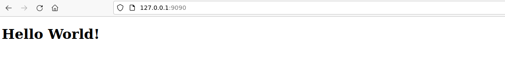

# In this lab we follow the following steps:
# Note: You can also mount dir 

1. We will create sample `hello world` website using html 

    

    
    

     
2. we will create volume with name `static-web`
    

    
    

     
3. we will create nginx container and attach volume to `/usr/share/nginx/html` path
4. Here  we will copy file index.html to `/usr/share/nginx/html`
    

    
    

     
5. Now we test if my hello world website work properly
    

    
    

     
6. Now I am having my website inside docker volume `static-web` not in container
7. Create new container with mapping diffrent port and same volume
    

    
    

     
8. Test same website is accessible from new container also

  

