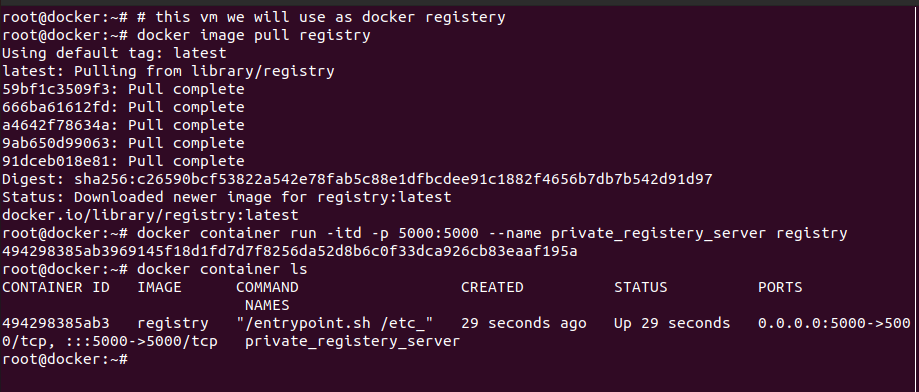
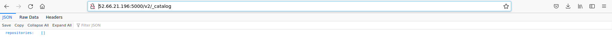
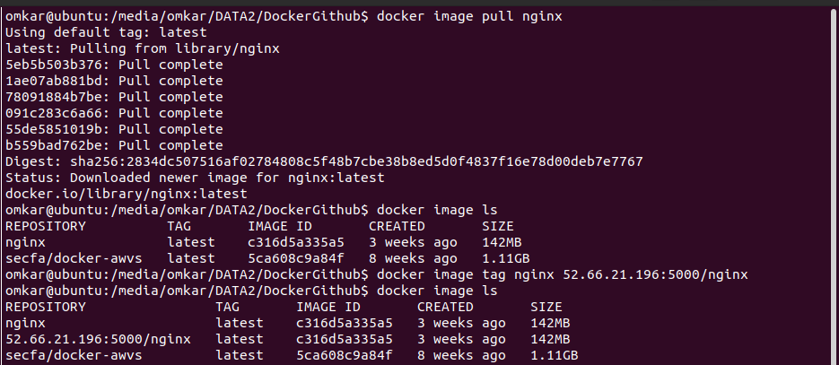
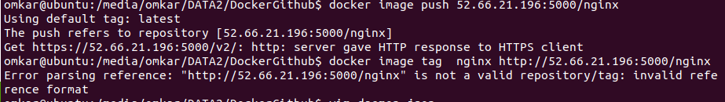
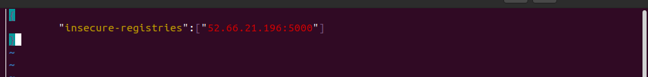
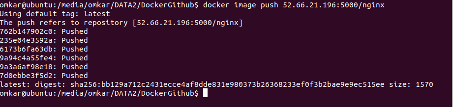
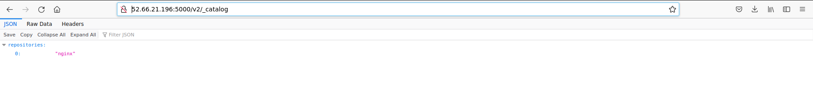

# Follow the following steps:

1. Create one vm which will use as docker registry. Install docker on it.
   By default docker registery runs on `5000` port. Follow as shown below.

 

2. Check with vm ip and port 5000 if it shows output as below.

 

3. Now your setup done for registry
   now get one sample image like nginx at tag it with ip and port of new private registry.

 

4. Now try to push the image to your repository. But you will see here the error like below.
   It clearly says that the repository should be https

 

5. To make it work. create one daemon.json file and write `{"insecure_registries":"<your_ip>:<port(5000)>"}`
   as shown below.This will basically skip the https.

 

 

6. Now push the tagged image to private repository. it will work fine.

 

7. Now hit same ip and port to check if the image is present in repository

 

8. You are good to go.