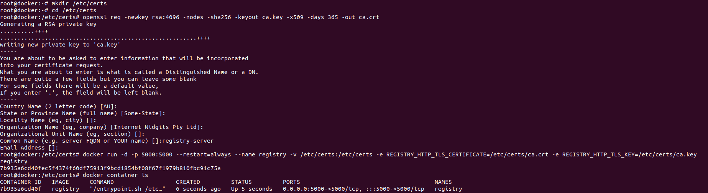

# Private docker registry with https

1. You should have two vm`s. One will basically work as registry-server and another will work as registry-client. 
   registry-server will work as private docker registry and from registry-client you can push and pull images. 
   Install docker on registry-server and  registry-client.

2. First we will setup registry-server. Follow the following steps as below: 
   Steps will create the ca certificate. After completing the steps you can find  
   that private registry is running on registry-server To test it hit url `https://<ip>:5000/v2/_catalog`
 
    Commands:
    - `mkdir /etc/certs`
    - `cd /etc/certs`
    - `openssl req -newkey rsa:4096 -nodes -sha256 -keyout ca.key -x509 -days 365 -out ca.crt`
    - `docker run -d -p 5000:5000 --restart=always --name registry -v /etc/certs:/etc/certs -e REGISTRY_HTTP_TLS_CERTIFICATE=/etc/certs/ca.crt -e REGISTRY_HTTP_TLS_KEY=/etc/certs/ca.key registry`

     
    

    
    

     

2. After completing above steps we will setup for registry-client.
   - Run cmd  `vim /etc/hosts`
   - add line `<ip_addr_of_registry_server>  registry-server` 
   - Run cmd `mkdir -p /etc/docker/certs.d/registry-server:5000`
   - Run cmd `sudo scp root@registry-server:/etc/certs/ca.crt /etc/docker/certs.d/registry-server\:5000/`
   - Run cmd `systemctl restart docker`
   - Tag your image `docker tag nginx registry-server:5000/nginx`  Here I am tagging my nginx image
   - Run cmd to push it `docker push registry-server:5000/nginx`  

     
    

    
    

     

     
    

    
    

     

### You have successfully added your private registry