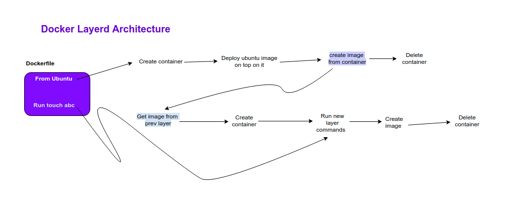
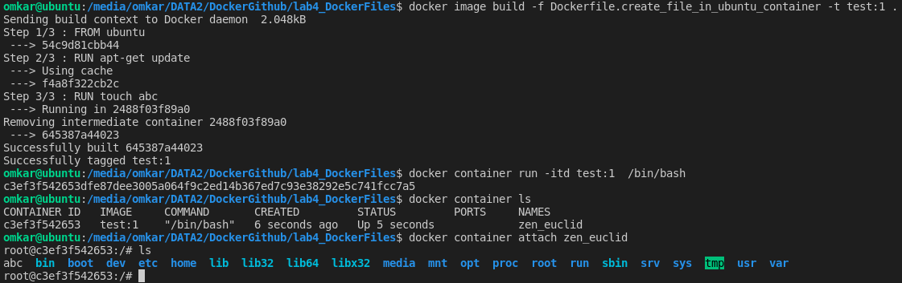
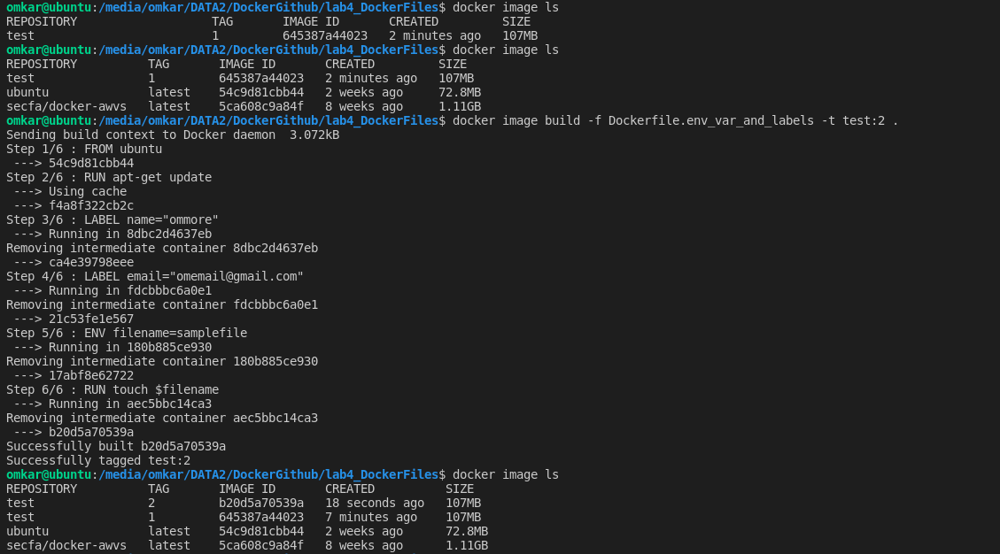
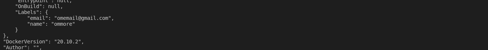
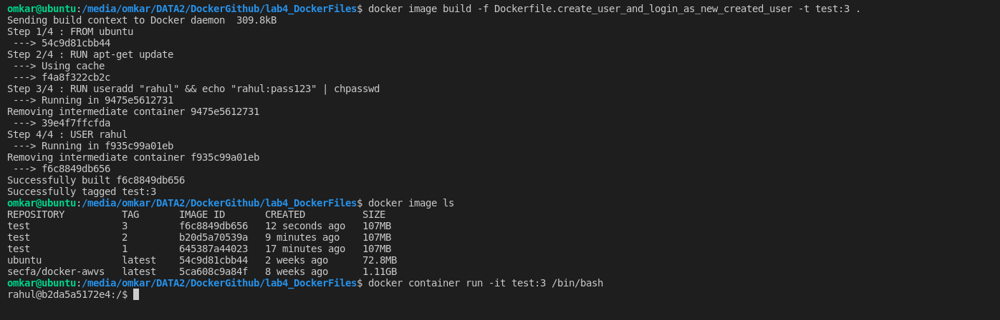
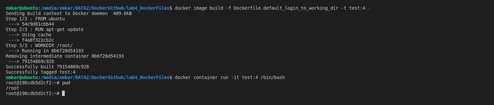
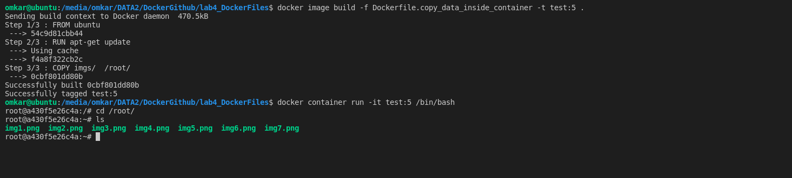
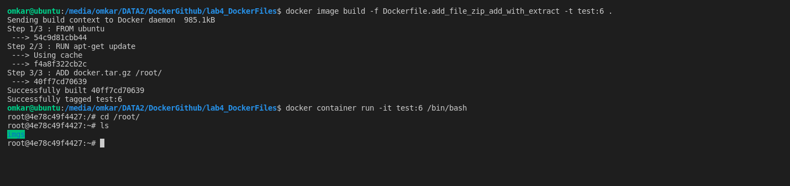
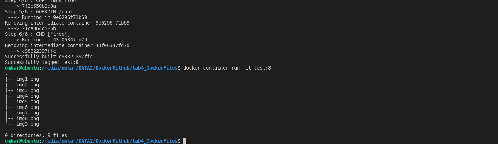
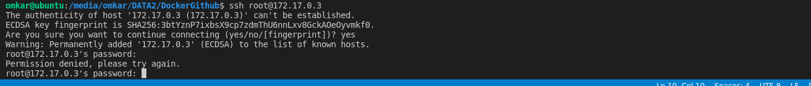

# Docker File Writing use cases:
1. Docker layered architecture working diagram

 

 

2.  `Dockerfile.create_file_in_ubuntu_container` is dockerfile which deployes  
   ubuntu image in docker container. And create text file `abc` in it 
   
 

 

3. `Dockerfile.env_var_and_labels` is dockerfile which tell us to how to create env variables  
   and labels in dockerfile. labels are set when extra information we provide in docker containe  
   like contact information i.e email which helps developer to reach out to docker file creater  
   if there is any issue with it.
 

 

 

 

4. The default docker user is root if you want to create a new user and when access to docker container provide   
   default shell for new created user then you can do it with file `Dockerfile.create_user_and_login_as_new_created_user`
 

 

 

5. When you login to docker container the default dir you login with is `/` dir. But any case you want  
to change dir you   need to make changes as like shown in `Dockerfile.default_login_to_working_dir`.
 

 

6. `Dockerfile.copy_data_inside_container` this docker file helps to copy data inside docker container.  
   from local machine 
 

 

7. `Dockerfile.add_file_zip_add_with_extract` this file helps to add a copy zip file inside docker container.  
    copy and add commands both are doing same work. But when you have a zip file to copy, better you use add  
    because it adds file with default unzipped format.

 

 

 

 

 

 

8. `Dockerfile.deploy_static_website_using_nginx` helps to deploy_static_website using nginx and docker.

 

 